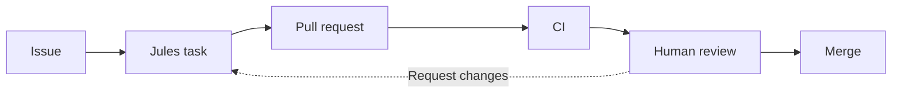

# AI Coding Workflow Starter Kit for Jules

[English](./README.md) · [한국어](./README.ko.md) · [프로젝트 준비 상태](./docs/meta/project-readiness.md) · [출시 체크리스트](./docs/meta/release-checklist.md) · [문서 감사](./docs/meta/documentation-audit.md) · [기여하기](./CONTRIBUTING.md) · [행동 강령](./CODE_OF_CONDUCT.md) · [보안](./SECURITY.md)

> 대부분의 AI 코딩 데모는 완성된 코드만 보여줍니다.  
> 이 프로젝트는 그 과정 자체를 보여줍니다.

**AI Coding Workflow Starter Kit for Jules**는 Jules를 GitHub Issue, Pull Request, Review, CI, case study, controlled automation 안에서 운영하기 위한 GitHub-native starter kit입니다.

이 저장소는 AI-assisted work가 읽을 수 있는 engineering history를 남기도록 돕습니다.



단순한 prompt 모음이 아니라 template, example, review checklist, CI gate, case study를 포함한 reusable workflow kit입니다.

---

## What You Get

- Jules task를 위한 scoped GitHub Issue template
- linked issue와 validation notes를 요구하는 PR template
- approve/request changes용 maintainer review example
- Markdown, YAML, required starter kit file을 확인하는 lightweight CI
- human-led workflow부터 sandbox-only automation experiment까지 나눈 workflow levels
- issue handoff와 daily maintainer report용 prompt
- 실제 프로젝트에 workflow를 적용한 case study

핵심 메시지는 단순합니다.

> Human maintainer가 AI coding agent를 일반적인 GitHub engineering practice 안에서 리드한다.

아래 메시지가 아닙니다.

> AI가 프로젝트 전체를 혼자 만들었다.

---

## Start Here

- **[Quickstart 가이드](./docs/quickstart.md)** — 단계별 온보딩
- **[운영 가이드](./docs/operations/one-jules-task-at-a-time.md)** — 안전한 태스크 순차 실행
- **[브랜치 보호 가이드](./docs/operations/branch-protection-and-ci-gates.md)** — CI 게이트와 `main` 보호

### 1. Starter Kit 파일 복사하기

자기 repository에 먼저 아래 파일들을 복사합니다.

```text
AGENTS.md
.github/ISSUE_TEMPLATE/
.github/PULL_REQUEST_TEMPLATE.md
.github/workflows/docs-and-templates.yml
prompts/
examples/
```

### 2. 작은 Issue 하나 열기

좋은 issue:

```text
Add a PR template that requires a linked issue, validation steps, and a reviewer checklist.
```

나쁜 issue:

```text
Improve the project.
```

### 3. Issue를 Jules에게 넘기기

Issue를 source of truth로 사용합니다. Jules는 issue를 대체하는 것이 아니라 focused PR을 만들어야 합니다.

### 4. Merge 전 Review하기

Merge 전에 다음을 확인합니다.

- PR이 linked issue를 해결하는가?
- scope가 통제되어 있는가?
- 관련 없는 파일이 바뀌지 않았는가?
- tests 또는 validation steps가 포함되어 있는가?
- CI가 통과하는가?
- 나중에 다른 개발자가 이 history를 이해할 수 있는가?

---

## Workflow Levels

이 starter kit은 안정적인 maintainer workflow와 실험적 automation을 분리합니다.

| Level | Workflow | Human role | Status |
| --- | --- | --- | --- |
| 1 | Human-led Jules workflow | issue 작성, PR review, merge | recommended default |
| 2 | Semi-autonomous Jules workflow | issue 작성, final PR review | practical advanced mode |
| 3 | Human issue only | issue만 작성, Jules가 implementation/PR update | advanced with strict CI |
| 4 | Daily agentic maintainer loop | daily report를 보고 방향 조정 | advanced planning loop |
| 5 | No-human sandbox workflow | 관찰 또는 audit만 수행 | experiment only |
| 6 | Jules + evaluator-driven evolution | objective/evaluator 정의, 결과 review | experiment only |

기본값은 Level 1입니다. Level 5와 6은 sandbox 또는 protected experiment branch에서만 다룹니다.

---

## Repository Structure

```text
.
├── README.md
├── README.ko.md
├── AGENTS.md
├── CONTRIBUTING.md
├── CODE_OF_CONDUCT.md
├── SECURITY.md
├── LICENSE
├── .github/
│   ├── ISSUE_TEMPLATE/
│   │   ├── jules_task.yml
│   │   └── workflow_experiment.yml
│   ├── workflows/
│   │   └── docs-and-templates.yml
│   └── PULL_REQUEST_TEMPLATE.md
├── examples/
│   ├── issues/
│   └── pr-reviews/
├── docs/
│   ├── quickstart.md
│   ├── meta/
│   │   ├── project-readiness.md
│   │   ├── release-checklist.md
│   │   └── documentation-audit.md
│   ├── operations/
│   │   ├── one-jules-task-at-a-time.md
│   │   └── branch-protection-and-ci-gates.md
│   ├── workflows/
│   │   └── workflow-levels.md
│   ├── experiments/
│   │   ├── no-human-only-jules-workflow.md
│   │   └── jules-alpha-evolve.md
│   └── case-studies/
│       ├── digital-logic-circuit.md
│       └── english-only-project.md
└── prompts/
    ├── issue-to-jules-task.md
    └── daily-maintainer-report.md
```

---

## Case Studies

### [Case Study A: Digital Logic Circuit](./docs/case-studies/digital-logic-circuit.md)

Repository: <https://github.com/hkimw-underground/digital-logic-circuit>

실제 hardware/software capstone case study입니다. planning과 implementation을 GitHub Issues, PRs, human review, Jules-assisted implementation 중심으로 옮기는 사례입니다.

Architecture, hardware constraints, scope, review, final merge decision은 maintainer가 책임집니다.

### [Case Study B: English-Only Open Source Project](./docs/case-studies/english-only-project.md)

Status: planned.

글로벌 독자를 위한 예정된 순수 영어 case study입니다. 학교/capstone 맥락 밖에서도 small issues, focused Jules PRs, CI-first development, readable review comments가 재사용 가능하다는 것을 보여주는 목적입니다.

---

## Safety Position

이 저장소는 automation을 다루지만, automation 자체를 기본 목표로 삼지 않습니다.

Stable guidance:

```text
Human decides direction.
Human owns architecture.
Human reviews final changes.
CI gates every merge.
Jules is never presented as a human contributor.
```

Experimental guidance:

```text
No-human workflows must run in sandbox repos or protected branches.
Auto-merge requires strict CI and branch protection.
Evaluator-driven evolution must use measurable tests or benchmarks.
```

---

## Why This Exists

대부분의 AI coding demo는 완성된 코드만 보여줍니다.

이 프로젝트는 과정을 보여줍니다.

```text
Issue.
Prompt.
Plan.
Pull request.
Review.
CI.
History.
```

진짜 AI-assisted engineering은 여기서 일어납니다.

---

## 라이선스

이 프로젝트는 [MIT 라이선스](./LICENSE)를 따릅니다.
