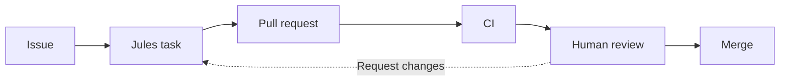

# AI Coding Workflow Starter Kit for Jules

[English](./README.md) · [한국어](./README.ko.md) · [Project Readiness](./docs/meta/project-readiness.md) · [Contributing](./CONTRIBUTING.md) · [Code of Conduct](./CODE_OF_CONDUCT.md) · [Security](./SECURITY.md)

> Most AI coding demos show only the final code.  
> This project shows the process.

**AI Coding Workflow Starter Kit for Jules** is a GitHub-native starter kit for leading Jules through issues, pull requests, reviews, CI, case studies, and controlled automation.

It is built for maintainers who want AI-assisted work to leave a clean engineering history:



This is not a prompt dump. It is a reusable workflow kit with templates, examples, review checklists, CI gates, and case studies.

---

## What You Get

- scoped GitHub Issue templates for Jules tasks
- PR templates that require linked issues and validation notes
- maintainer review examples for approving or requesting changes
- lightweight CI checks for Markdown, YAML, and required starter kit files
- workflow levels from human-led work to sandbox-only automation experiments
- prompts for issue handoff and daily maintainer reports
- case studies showing how the workflow applies to real projects

The core idea is simple:

> A human maintainer leads an AI coding agent through normal GitHub engineering practice.

Not:

> AI built the whole project by itself.

---

## Start Here

**[Quickstart Guide](./docs/quickstart.md)** (for a step-by-step onboarding)

### 1. Copy the Starter Kit Files

Start with these files in your own repository:

```text
AGENTS.md
.github/ISSUE_TEMPLATE/
.github/PULL_REQUEST_TEMPLATE.md
.github/workflows/docs-and-templates.yml
prompts/
examples/
```

### 2. Open a Small Issue

Good issue:

```text
Add a PR template that requires a linked issue, validation steps, and a reviewer checklist.
```

Bad issue:

```text
Improve the project.
```

### 3. Hand the Issue to Jules

Use the issue as the source of truth. Jules should produce a focused PR, not replace the issue.

### 4. Review Before Merge

Before merging, check:

- Does the PR solve the linked issue?
- Is the scope controlled?
- Are unrelated files changed?
- Are tests or validation steps included?
- Does CI pass?
- Would another developer understand this history later?

---

## Workflow Levels

This starter kit separates stable maintainer workflows from experimental automation.

| Level | Workflow | Human role | Status |
| --- | --- | --- | --- |
| 1 | Human-led Jules workflow | creates issue, reviews PR, merges | recommended default |
| 2 | Semi-autonomous Jules workflow | creates issue, reviews final PR | practical advanced mode |
| 3 | Human issue only | writes issue; Jules handles implementation and PR updates | advanced with strict CI |
| 4 | Daily agentic maintainer loop | steers direction from daily reports | advanced planning loop |
| 5 | No-human sandbox workflow | observes or audits only | experiment only |
| 6 | Jules + evaluator-driven evolution | defines objective/evaluator and reviews result | experiment only |

The default workflow is Level 1. Levels 5 and 6 belong in sandboxes, not unprotected production branches.

---

## Repository Structure

```text
.
├── README.md
├── README.ko.md
├── AGENTS.md
├── CONTRIBUTING.md
├── CODE_OF_CONDUCT.md
├── SECURITY.md
├── LICENSE
├── .github/
│   ├── ISSUE_TEMPLATE/
│   │   ├── jules_task.yml
│   │   └── workflow_experiment.yml
│   ├── workflows/
│   │   └── docs-and-templates.yml
│   └── PULL_REQUEST_TEMPLATE.md
├── examples/
│   ├── issues/
│   └── pr-reviews/
├── docs/
│   ├── workflows/
│   │   └── workflow-levels.md
│   ├── experiments/
│   │   ├── no-human-only-jules-workflow.md
│   │   └── jules-alpha-evolve.md
│   └── case-studies/
│       ├── digital-logic-circuit.md
│       └── english-only-project.md
└── prompts/
    ├── issue-to-jules-task.md
    └── daily-maintainer-report.md
```

---

## Case Studies

### [Case Study A: Digital Logic Circuit](./docs/case-studies/digital-logic-circuit.md)

Repository: <https://github.com/hkimw-underground/digital-logic-circuit>

A real hardware/software capstone case study showing how planning and implementation can move into GitHub Issues, PRs, human review, and Jules-assisted implementation.

The maintainer owns architecture, hardware constraints, scope, review, and final merge decisions.

### [Case Study B: English-Only Open Source Project](./docs/case-studies/english-only-project.md)

Status: planned.

A planned English-only case study for a global audience. It will demonstrate the same workflow outside a school/capstone context: small issues, focused Jules PRs, CI-first development, and readable review comments.

---

## Safety Position

This repository supports automation, but it does not treat automation as the default goal.

Stable guidance:

```text
Human decides direction.
Human owns architecture.
Human reviews final changes.
CI gates every merge.
Jules is never presented as a human contributor.
```

Experimental guidance:

```text
No-human workflows must run in sandbox repos or protected branches.
Auto-merge requires strict CI and branch protection.
Evaluator-driven evolution must use measurable tests or benchmarks.
```

---

## Why This Exists

Most AI coding demos show only the final code.

This project shows the process:

```text
Issue.
Prompt.
Plan.
Pull request.
Review.
CI.
History.
```

That is where real AI-assisted engineering happens.

---

## License

This project is licensed under the [MIT License](./LICENSE).
